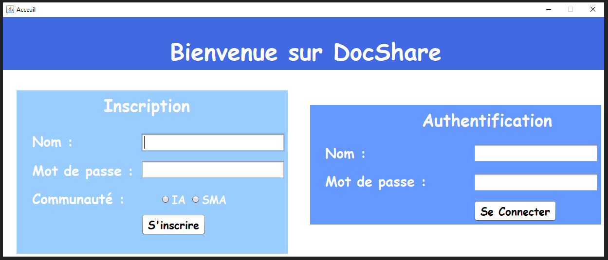

# SMA-Documents-Sharing
Réalisation d'un Système Multi-Agents (SMA) pour le partage des documents. 

Les utilisateurs doivent d'abord s'inscrire au système afin de pouvoir envoyer/recevoir tout type de ressources documentaires. 

Chaque utilisateur représenté par un agent autonome peut partager des documents avec les autres utilisateurs qui ont le même centre d'intérêt que lui. (IA ou SMA).
Comme exemple nous allons créer 4 agents : Fatma, Rym, Sarah et Lina. 

Fatma et Rym font partie de la communauté IA. 

Sarah et Lina font partie de la communauté SMA. 

Fatma envoie le document "machine_learning_with_python_tutorial.pdf" aux utilisateurs de la communauté . 

Rym reçoit le document. 

